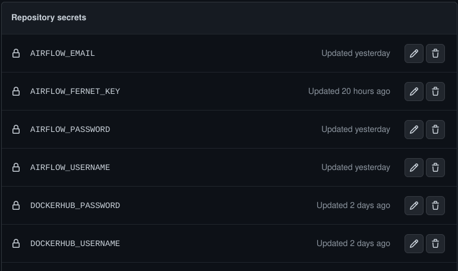
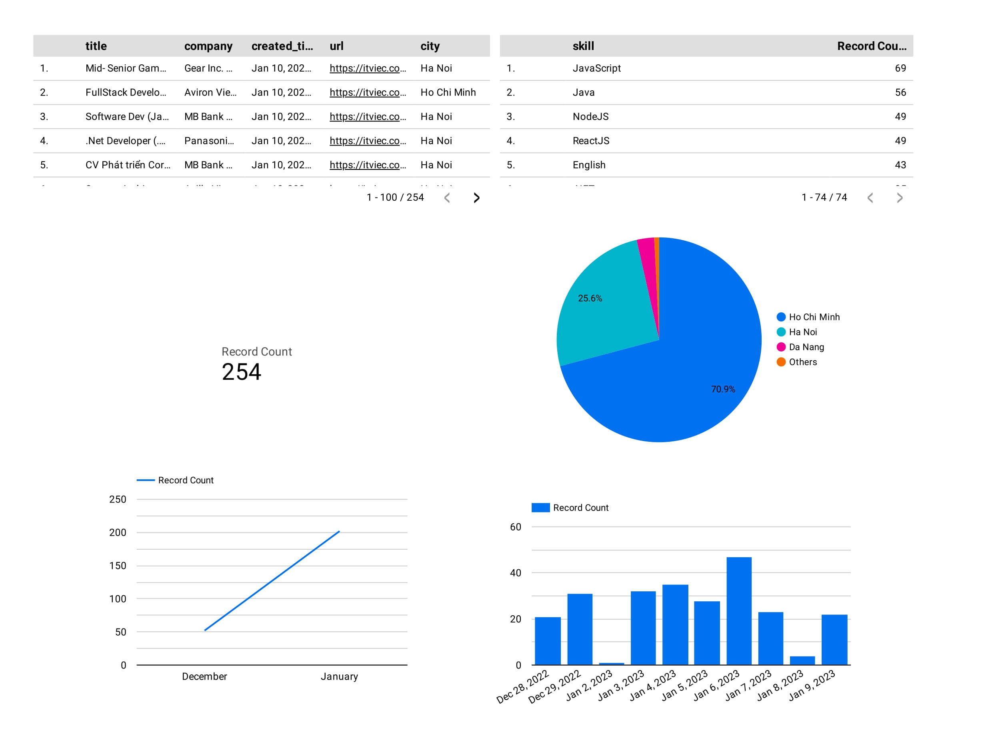

# **Job ETL Pipeline**

<!-- TABLE OF CONTENTS -->
<details>
  <summary>Table of Contents</summary>
  <ol>
    <li><a href="#motivation">Motivation</a></li>
    <li><a href="#built-with">Built With</a></li>
    <li><a href="#usage">Usage</a></li>
    <li><a href="#contributing">Contributing</a></li>
    <li><a href="#contact">Contact</a></li>
  </ol>
</details>


<br />

<!-- ABOUT THE PROJECT -->
# Motivation
I want to make a beginner data engineering project, also want to look for a new job. So i made this data pipeline that crawl data from job search website, store data in data warehouse and load data to visualization tool.

# Built With

* [Airflow](https://airflow.apache.org/)
* [Amazon S3](https://aws.amazon.com/s3/)
* [Amazon Redshift](https://aws.amazon.com/redshift/)
* [Amazon EC2](https://aws.amazon.com/ec2/)
* [Looker Studio](https://datastudio.google.com/)
* [Docker](https://www.docker.com/)
* [Github Action](https://github.com/features/actions)


# Architecture


1. Extract data using `Scrapy`
2. Load raw data to `S3 bucket` 
4. Add timestamp field and upsert data to `Redshift` data warehouse
5. Use `Looker Studio (Google Data Studio)` to visualize our data 
6. Orchestrate with `Airflow` using `Docker` in `EC2 instance`
7. Implement `CI/CD` and `Unit Testing` using `Github Action`  


<br />

# Environment Setup
## Cloud Services Used  

<pre>
Redshift cluster type <b>dc2.large</b>
S3 bucket
EC2 instance type <b>t2.medium</b> 
IAM role to allow Redshift access to S3
</pre>

<br />  

## Setting Up Airflow
I use `Docker Compose` to setup Airflow. There are 3 components: `webserver`, `scheduler` and `Postgres` as our database. Details in [docker-compose.yml](docker-compose.yml)  

Pipeline DAG:


Graph View:


<br />  

## Configuring connections and variables

This pipeline uses `File System`, `Redshift` and `S3` **connections**. To configure connections, I used Airflow's UI:  


To configure **variables**, create a `json` file like this: 
```
{
	"bucket_name": "xxx",
	"aws_region": "xxx",
	"iam_role": "xxx",
	"redshift_conn_id": "Xxx",
	"email": "xx"
}

```
Then use the `Import Variables` feature in Airflow's UI:  


# Deployment

## CI/CD Pipeline  

Triggers on pushing to branch `dev`. The steps are:  

1.  Checkout our current repository
2.  Login Docker Hub
3.  Get short commit hash for image tag
4.  Buid push image to Docker Hub
5.  Unit test
6.  Deploy to EC2 instance
   
Details in [workflow file](.github/workflows/cicd.yml)

Use Github Secrets to configure secrets  



# Output  

The result is vailable [here](https://datastudio.google.com/reporting/d8cf3a97-1f06-4854-8001-fb57c6b17c49). This is just a simple visualization  




<br />

<!-- CONTRIBUTING -->
## Contributing

If you have a suggestion that would make this better, please fork the repo and create a pull request. Thank you very much!


<!-- CONTACT -->
## Contact

Đức. Chu Nguyên 
- [Linkedin](https://www.linkedin.com/in/nguyenducchu1999/)
- Email: nguyenducchu1999@gmail.com
